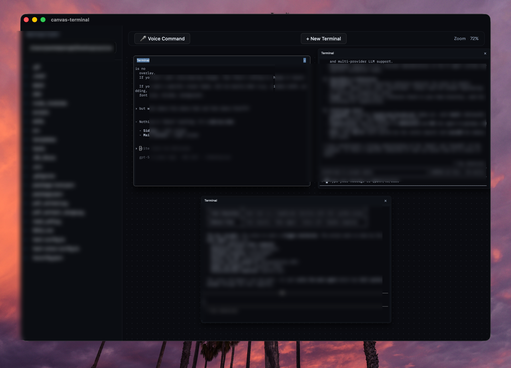

# TSwarm



## One‑Command Install

### macOS / Linux
```bash
curl -fsSL https://raw.githubusercontent.com/Sankalpcreat/TSwarm/main/scripts/install.sh | bash
```

### Windows (PowerShell)
```powershell
iwr -useb https://raw.githubusercontent.com/Sankalpcreat/TSwarm/main/scripts/install.ps1 | iex
```

## Notes
- This installs the latest GitHub Release build.
- macOS installs into `/Applications`.
- Linux installs into `~/.local/bin/` (make sure it’s in your PATH).
